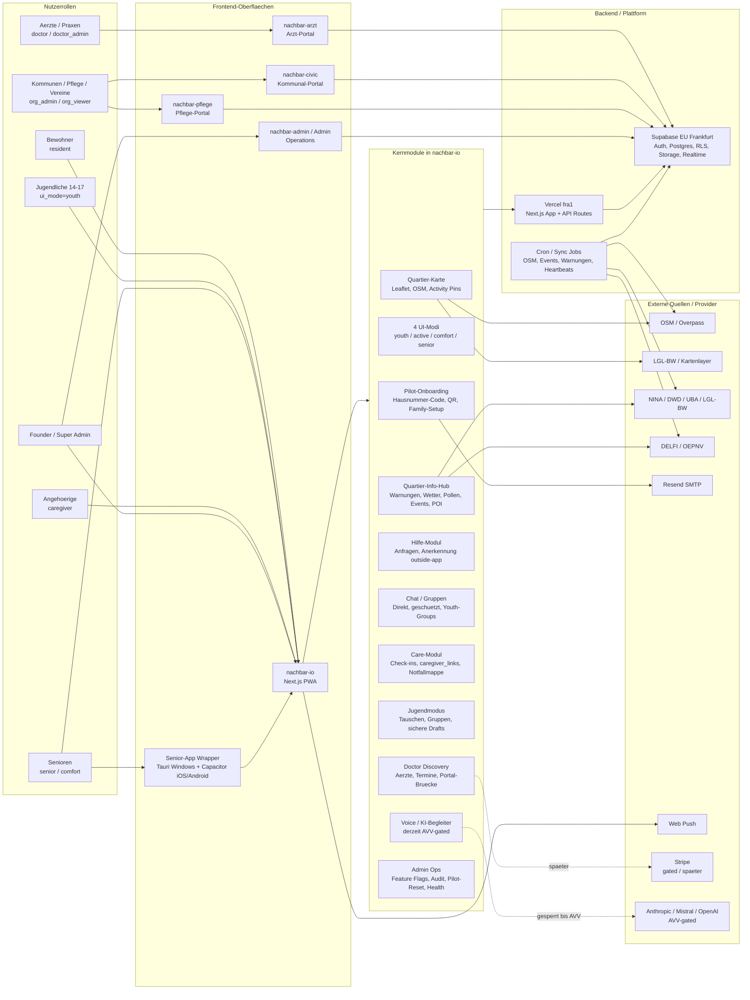
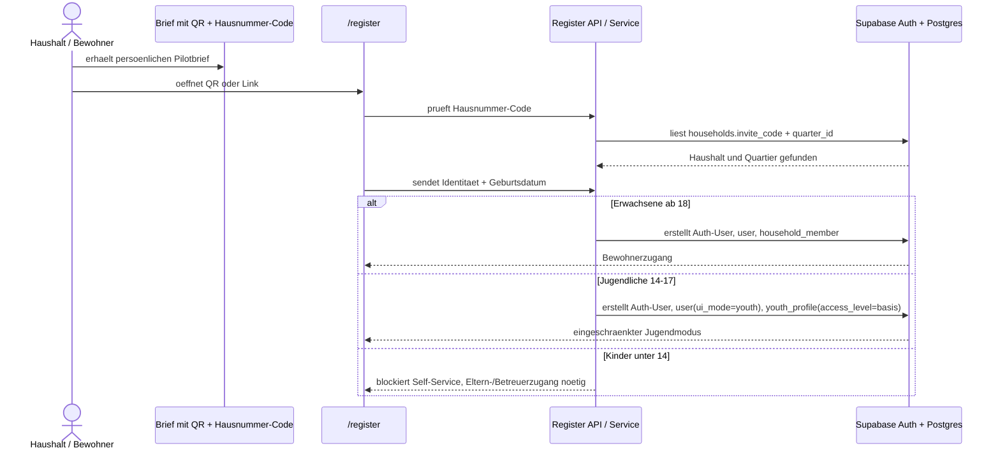
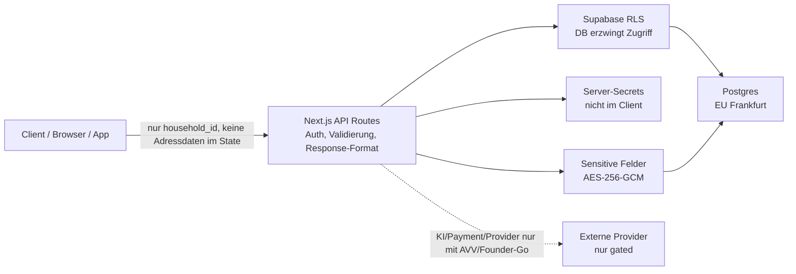

# Nachbar.io Systemkarte fuer IT-Review

Datum: 2026-05-15
Zweck: Ein IT-Profi soll auf den ersten Blick erkennen, welche Apps, Module, Datenfluesse, Integrationen und Sicherheitsgrenzen im aktuellen Nachbar.io/QuartierApp-System existieren.

## Kurzbild

Nachbar.io ist keine einzelne App mehr, sondern eine Quartiersplattform mit mehreren Oberflaechen auf einem gemeinsamen Supabase-Datenmodell.

## Modulkarte nach fachlichen Bereichen

```mermaid
flowchart TB
  Root["Nachbar.io / QuartierApp<br/>Pilot Bad Saeckingen"]

  Root --> Zugang["Zugang & Identitaet"]
  Zugang --> Auth["Supabase Auth<br/>Magic Link / Passkey / Session"]
  Zugang --> Codes["Hausnummer-Code<br/>households.invite_code"]
  Zugang --> Family["Family-/QR-Setup<br/>Senior + Angehoerige verknuepfen"]
  Zugang --> Pilot["Closed Pilot Gate<br/>nur Invite/Code sichtbar"]

  Root --> Oberflaechen["Oberflaechen"]
  Oberflaechen --> YouthUI["Jugendmodus<br/>Start, Karte, Tauschen, Gruppen"]
  Oberflaechen --> ActiveUI["Active Mode<br/>normales Dashboard"]
  Oberflaechen --> ComfortUI["Comfort Mode<br/>ruhiger, groessere Abstaende"]
  Oberflaechen --> SeniorUI["Senior Mode<br/>80px Targets, max 4 Taps"]

  Root --> Quartier["Quartier & Karte"]
  Quartier --> Map["Leaflet + OSM<br/>anonymisierte Haus-Anker"]
  Quartier --> Pins["Activity Pins<br/>Regeln: gruen/gelb/rot/blau"]
  Quartier --> Info["Info-Hub<br/>Warnungen, Wetter, Pollen, Muell, Events"]
  Quartier --> POI["OSM POIs / DELFI<br/>Cron-Sync"]

  Root --> Alltag["Alltag & Community"]
  Alltag --> Hilfe["Nachbarschaftshilfe<br/>Anfragen, freiwillige Anerkennung"]
  Alltag --> Chat["Chat / Gruppen<br/>Direkt, Gruppen, Youth-Groups"]
  Alltag --> Events["Veranstaltungen<br/>Feed und Karte"]
  Alltag --> Gamification["Punkte / Badges<br/>dezent, nicht zwingend"]

  Root --> CareBlock["Care / Senior / Notfall"]
  CareBlock --> Checkin["Check-in / Heartbeat"]
  CareBlock --> Links["caregiver_links<br/>authoritative Beziehung"]
  CareBlock --> Crypto["AES-256-GCM<br/>sensitive Felder"]
  CareBlock --> SOS["Notfallbanner<br/>112/110 immer zuerst"]

  Root --> AdminBlock["Betrieb & Kontrolle"]
  AdminBlock --> Flags["Feature Flags<br/>Pilot-Phasen"]
  AdminBlock --> Audit["Audit Logs<br/>Admin-Aktionen"]
  AdminBlock --> Health["Health / Cron Heartbeats"]
  AdminBlock --> Reset["Pilot-Reset / Cleanup<br/>nur mit Founder-Go"]

  Root --> Medical["Medical / Partner"]
  Medical --> Arzt["Arzt-Portal<br/>Praxen, Patienten, Termine"]
  Medical --> Pflege["Pflege-Portal<br/>Community/Care-Partner"]
  Medical --> Civic["Civic-Portal<br/>Kommunale Inhalte"]
```

## Pilot-0-Registrierung aktuell

Der alte Gedanke "3 Codes pro Hausnummer plus Ersatzcodes" ist verworfen. Aktuell gilt: ein bestehender Hausnummer-Code pro Haushalt.

## Sicherheits- und DSGVO-Grenzen

Wichtige harte Regeln:

| Bereich | Regel |
|---|---|
| Adressen | Keine Adressdaten im Client-State, nur `household_id`. |
| Zugriff | Supabase RLS auf allen relevanten Tabellen. |
| Sensitive Care-Daten | AES-256-GCM via `lib/care/field-encryption.ts`. |
| Notfall | Fire/Medical/Crime zeigen immer 112/110 zuerst. |
| API-Listen | Listen als Array, nicht `{ items: [...] }`. |
| KI | Personenbezogene KI-Nutzung bleibt bis AVV/DPA-Freigabe gesperrt. |
| Payment | Stripe/Billing live erst spaeter, kein Pilot-0-Scope. |
| Prod-Aktionen | Prod-DB, Migrationen, Secrets, Billing, Deploy nur mit Founder-Go, soweit rote Zone. |

## Statusampel 2026-05-15

| Block | Status | Bemerkung |
|---|---|---|
| Production nachbar-io | Live | `https://nachbar-io.vercel.app`, letzter bekannter Live-Commit `293f177`. |
| Pilot-0 Hausnummer-Code | Live / abnahmebereit | `/register` zeigt Brief/Hausnummer-Code, kein Aushang. |
| Jugendmodus 14-17 | Implementiert | Eingeschraenkter Basiszugang mit `ui_mode=youth`. |
| Unter-14-Blockade | Implementiert | Kein Self-Service, Eltern-/Betreuerzugang noetig. |
| Family-/QR-Setup | Implementiert | Senior/Angehoerige-Verknuepfungen vorbereitet. |
| Map Activity Pins | Implementiert | Local Preview/Layer, serverseitige Sichtbarkeitsregeln. |
| Info-Hub Welle 1 | Live | NINA/DWD/UBA/LGL-BW, OSM/Events-Crons vorbereitet. |
| Arzt-/Civic-/Pflege-Portale | Vorhanden | Eigene Oberflaechen, gemeinsames Datenmodell/Portal-Logik. |
| KI/Voice persoenlich | Gated | Wartet auf AVV/DPA und Founder-Go. |
| Payment/Stripe | Gated | Nicht Pilot 0. |
| Ersatzcode-System | Bewusst nicht gebaut | Fuer Pilot 0 zu komplex. |

## Fuer einen IT-Profi in einem Satz

Nachbar.io ist eine Next.js-16/Supabase-Quartiersplattform mit rollenbasierten Oberflaechen fuer Bewohner, Jugendliche, Senioren, Angehoerige, Kommunen, Pflege und Aerzte; die Pilot-0-Zugangskontrolle laeuft ueber Haushaltscodes und RLS, externe Daten werden per Cron/Provider synchronisiert, und sensible KI-/Payment-/Prod-Aktionen sind bewusst gegated.
